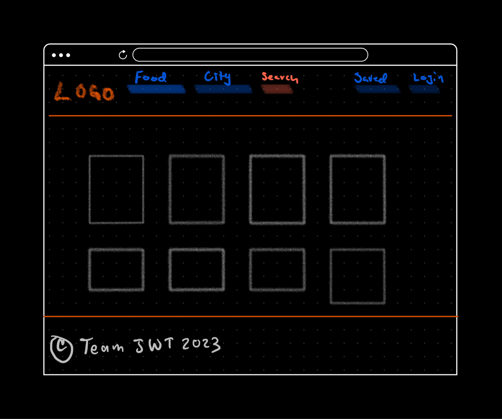
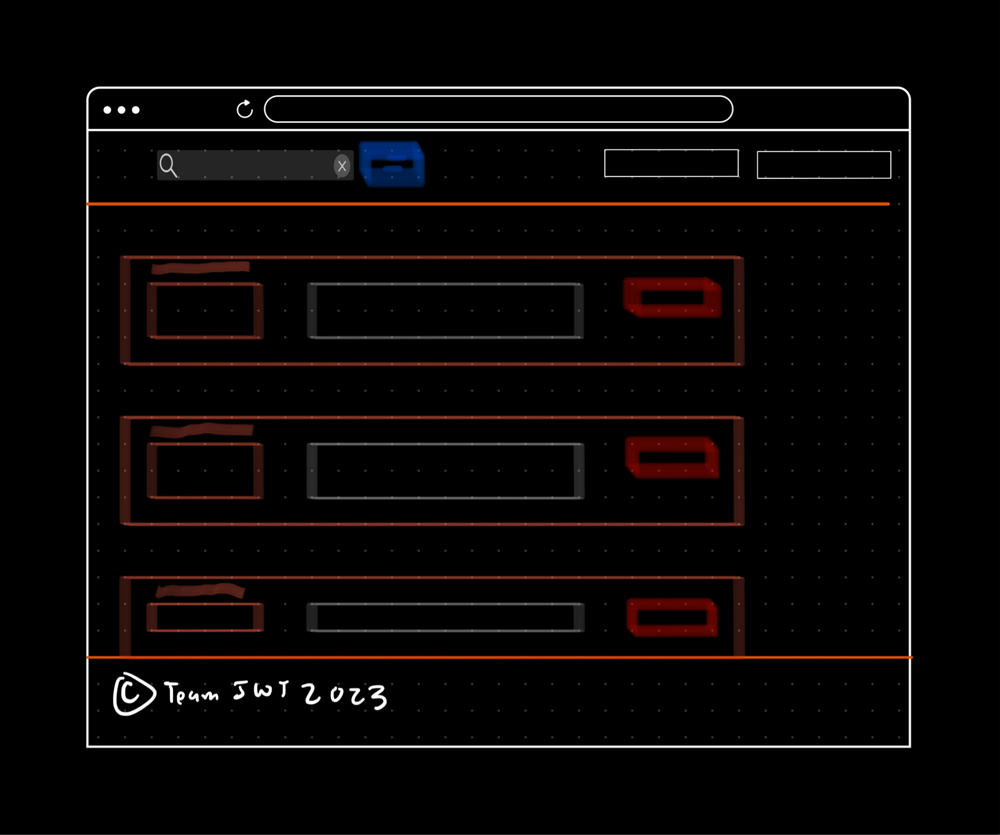
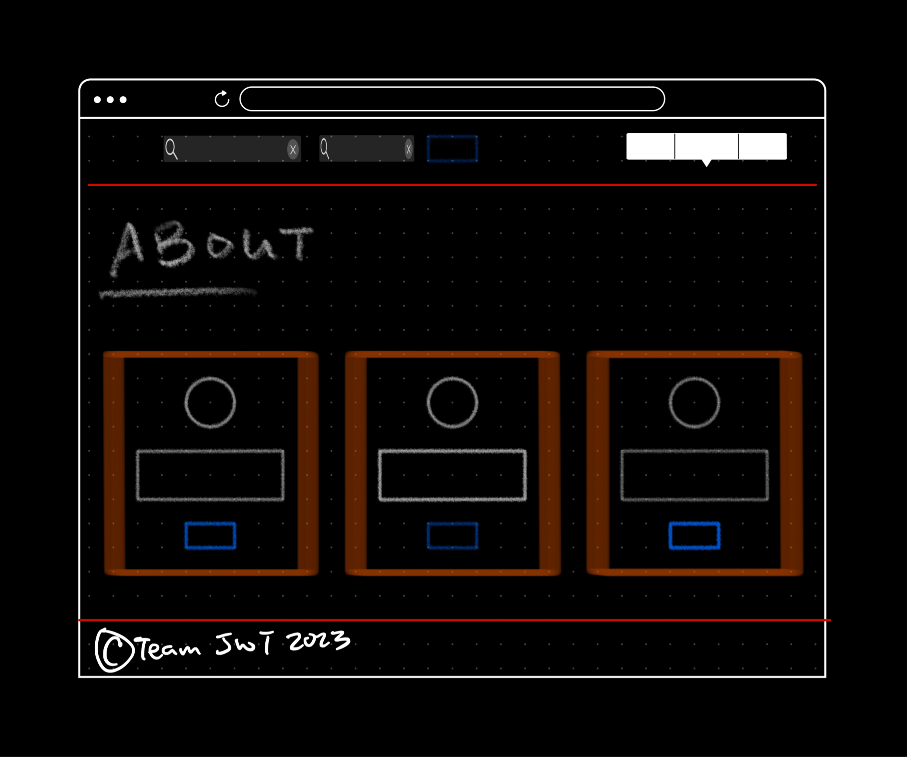
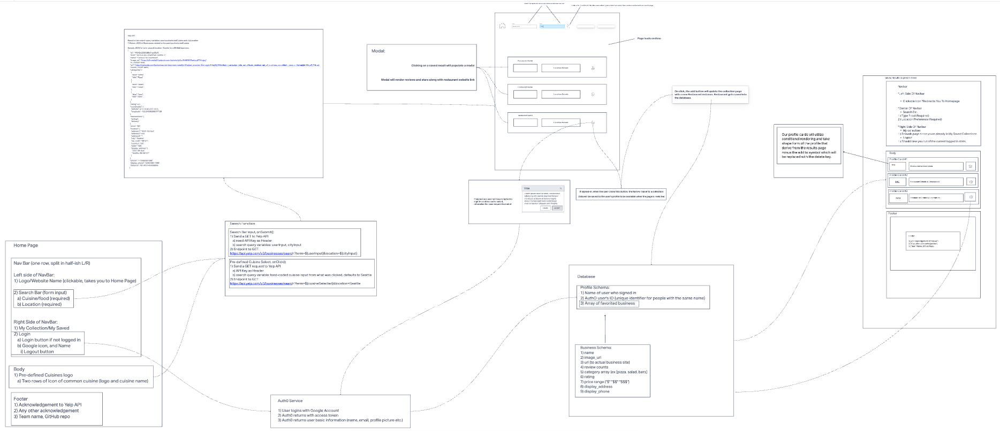

# Project Agreement

Kameron Watts, Zachariah Jeter, Cheryl McCalop, Jonathan Tsai

## Cooperation Plan

### What are the key strengths of each person on the team?

Zach - Willingness to taking on any tasks and contribute to all parts of the project. Zach's top strengths revolve around styling (CSS and React-Bootstrap).

Jonathan - Williing to do anything to to complete the project and is strong in JavaScript. Very comfortable with back-end task management.

Cheryl - Cheryl loves anything front-end and loves HTML, CSS, and DOM manipulation.

Kam - Kam's strength revolve around connecting the front-end back-end functionality. Comfortable with Axios, Express, Node, and GitHub. And intermediate in JavaScript functionality - but confident.

### How can you best utilize these strengths in the execution of your project?

We expect to capitalize on our strengths as a team by referring to other members that are demonstrating a good understanding in the project in that particular area.

### In which professional competencies do you each want to develop greater strength?

Cheryl - Wants to improve on her teamwork and time management capabilities.

Jonathan - Jonathan wants to work on motivation - staying consistent with tasks or projects that he does not have much interest in.

Zach - Wants to work on self-confidence.

Kam - Wants to improve quality orientation and research/planning

### Knowing that every person in your team needs to understand all aspects of the project, how do you plan to approach the day-to-day work?

Breaking down tasks effectively to make sure problems are being solved little-by-little to ensure we're making forward progress. Group-reflection and adjusting our goals to meet the rubric requirements will be a daily priority.

## Conflict Plan

### What will be your group’s process to resolve conflict, when it arises?

We will talk through any issues to make sure the issues are at the forefront to be resolved. All opinions and facts will be taken into consideration in order to support the psychological safety of the environment we're working in as a group. If every one on the team is able to express their free-thinking, this only works to our benefit to keep moving forward.

### What will your team do if one person is taking over the project and not letting the other members contribute?

We plan to be proactive in our plan to make sure no one is contributing an overwhelming amount of the project build. With our final project idea, we will delegate accordingly based on what needs to be done in conjuction with the strengths and weaknesses of each team member.

### How will you approach each other and the challenges of the project knowing that it is impossible for all members to be at the exact same place in understanding and skill level?

We plan to be proactive in our plan to make sure no one is contributing an overwhelming amount of the project build. With our final project idea, we will delegate accordingly based on what needs to be done in conjuction with the strengths and weaknesses of each team member.

### How will you raise concerns to members who are not adequately contributing?

Approach this team member and ask them what and why they are struggling and then work with them the best we can until outside assistance from a TA or instructor is needed to help mediate the situation.

### How and when will you escalate the conflict if your resolution attempts are unsuccessful?

We will escalate the conflict to a higher level if group progress comes to a halt or if we feel we are on the verge of not completing the project due to the conflict.

## Communication Plan

### What hours will you be available to communicate?

Jonathan - Always available on Slack

Cheryl - Always available 24/7

Zach -  Available 0900-1700 and 1900-2300

Kam - Available at all  times

### What platforms will you use to communicate (ie. Slack, phone …)?

Slack, Remo, Zoom and Discord

### How often will you take breaks?

As needed. We understand as a group that breaks are essential to production efforts.

### What is your plan if you start to fall behind?

We will do 1-on-1s or team meetings to identify the problem, figure out if we're able to solve it - if not, the task can be redeligated or re-assessed upon agreement. We will use our conflict resolution strategies to get through this shortfall.

### How will you communicate after hours and on the weekend?

If someone has something to share about the project, a message will be sent in the group Slack so no one is interrupted. There's an expectation for everyone in the group to check the group Slack just in case there's some worth-while information. No one is obliged to respond immediately, but to be up-to-date and acknowledge with a 'like' or reply message.

### What is your strategy for ensuring everyone’s voice is heard?

Stand-ups in the morning which requires a mandatory input from each team member, check-ins during the project-build in the middle of the day to see if progress is being made or new blockers arose, and a milestone check-in after a new task has been accomplished.

### How will you ensure that you are creating a safe environment where everyone feels comfortable speaking up?

By not judging their input and being engaged with what they are communicating. If someone sounds like they are lost in how they are trying to communicate, the team will help assist them to gather the right message so a clear understanding is established and that person feels heard.

## Work Plan

### How you will identify tasks, assign tasks, know when they are complete, and manage work in general?

We are using GitHub Projects to keep track of the project tasks. Tasks will be delegated and if there are any concerns, we will reasses who the task is going to. If new tasks arise, we will see where that task will fit best. This will be based on a team agreement with who will take on the new task at-hand for what best fits the team objective for that day. Each team member is expected to have an 'even playground' with the difficulty of the tasks and how they are assigned.

### What project management tool will be used?

GitHub Projects

# Wireframe

Homepage

Results and Saved Collection page

About Us

# Domain Modeling

UML Diagram

# User Stories

### Search Milestone

1) Search
2) The user should be able to search for a specific food item or cuisine in a particular city/location.
3) The task involved will need to request data from Yelp to help generate a list of businesses that are related to the search query the user has inputted in the search.
4) Should recieve a JSON file that is an array of businesses object with business information properties that fulfill the search terms submitted to Yelp

### Login Milestone

1) Login
2) The user should be able to login to keep a profile within the website
3) The task invovles using Auth0 React component provided in their documentation to implement the login button, redirects to the Auth0 authentication server, rendering the profile info, and the logout button. Their profile info (name and email) should be stored into the database.
4) The user should be able to go through Auth0 authentication service, see their profile info (ie name or email), and be able to logout.

### Database Milestone

1) Store and Retrieve
2) The user profile should be stored in the database to keep their saved businesses unique to the user.
3) The task invovles creating the database, have one collection that contains the following: User profile info and an array of favorited businesses object.
4) The user should able to retrieve their favorited businesses if they're signed in when favorited.

### Retrieve Milestone

1) Retrieve favorited businesses
2) The user clicks into "My Collection" and their favorited businesses would render. They would also have the option to delete any favorited businesses.
3) The task invovles querying the database to retrieve the correct profile, and map out business components based on what was in the array of favorited businesses. If the user clicks delete on a specific business they want to remove, it is removed from the page and also deleted from the database.
4) The user should see what they favorited and edit out what they don't want.

# Database Schema

The schema for this project would contain a two collections: Profile and Business

The Profile schema will contain the following:

1) Name (String, required)
2) Email (String, required)
3) Profile Img (string, not required)
4) Array of Business Objects (objects, required)

The Business schema will contain the following:

1) Name (String, required)
2) image_url (String, required)
3) URL (String, required)
4) Review Counts (Number, required)
5) Category (Array, required)
6) Rating (Number, required)
7) Price range (String, required)
8) dispplay_address (String, required)
9) display_phone (String, required)